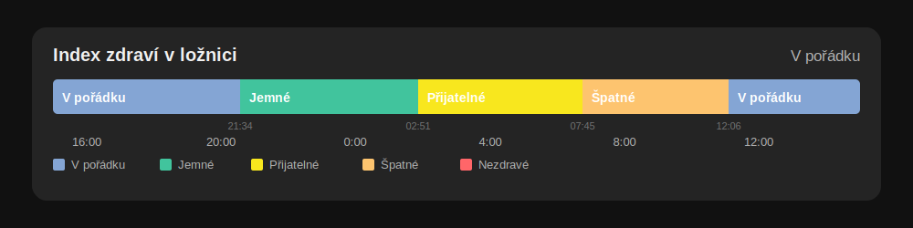

# Custom History Bar

Vlastní karta pro dashboard Home Assistantu, která zobrazuje historii stavů jako barevný časový pruh podobný kartě History Graph. Je připravená pro enum senzor **Netatmo Index zdraví**, ale funguje i s jinými entitami, které mají v atributu `options` seznam stavů.

Barvy se mapují na surové hodnoty stavů (`healthy`, `fine`, …), takže fungují nezávisle na jazyku Home Assistantu. Popisky na kartě se naopak zobrazují v jazyku rozhraní, pokud je Home Assistant umí přeložit.



## Funkce

- časově přesný pruh za volitelný počet hodin,
- vlastní barva každého stavu,
- vizuální editor karty včetně výběru barvy,
- výchozí paleta pro všech pět stavů Netatmo Indexu zdraví,
- volitelná legenda, aktuální stav a časová osa,
- podpora libovolné CSS barvy včetně `var(--moje-barva)`,
- tooltip s intervalem a délkou každého segmentu,
- respektování časové zóny nastavené v Home Assistantu,
- kliknutím na kartu se otevře detail entity.

## Instalace přes HACS

HACS instaluje vlastní dashboardové karty pouze z veřejného GitHub repozitáře. Pokud tento projekt zatím máte jen lokálně, nejprve celý obsah nahrajte do veřejného repozitáře, ideálně pojmenovaného `custom-history-bar`. Soubor `dist/custom-history-bar.js` musí být součástí repozitáře.

1. V Home Assistantu otevřete **HACS**.
2. V menu se třemi tečkami vyberte **Vlastní repozitáře / Custom repositories**.
3. Vložte URL repozitáře, například `https://github.com/UZIVATEL/custom-history-bar`.
4. Jako typ vyberte **Dashboard** a repozitář přidejte.
5. Otevřete nově přidaný projekt **Custom History Bar** a zvolte **Stáhnout / Download**.
6. Obnovte stránku Home Assistantu; při potížích použijte tvrdé obnovení prohlížeče (`Ctrl+F5`).

HACS obvykle frontendový zdroj přidá automaticky. Pokud se karta v editoru neobjeví, otevřete **Nastavení → Dashboardy → nabídka se třemi tečkami → Zdroje** a přidejte JavaScript modul:

```text
/hacsfiles/custom-history-bar/custom-history-bar.js
```

Potom v dashboardu zvolte **Přidat kartu**, vyhledejte **Custom History Bar** a nastavte entitu a barvy ve vizuálním editoru.

## Ruční instalace

1. Zkopírujte `dist/custom-history-bar.js` do adresáře `/config/www/` v Home Assistantu.
2. V **Nastavení → Dashboardy → Zdroje** přidejte zdroj typu **JavaScript modul** s URL `/local/custom-history-bar.js`.
3. Obnovte stránku Home Assistantu a přidejte kartu do dashboardu.

## Základní konfigurace

Ve většině případů stačí zvolit entitu ve vizuálním editoru. Stejnou kartu lze zapsat také v YAML:

```yaml
type: custom:custom-history-bar
entity: sensor.netatmo_loznice_index_zdravi
hours_to_show: 24
state_colors:
  healthy: "#2e7d32"
  fine: "#7cb342"
  fair: "#f9a825"
  poor: "#ef6c00"
  unhealthy: "#c62828"
```

Klíče v `state_colors` musí odpovídat hodnotě `state`, nikoli přeloženému atributu `translated`. Pro Netatmo tedy použijte `healthy`, i když Home Assistant stav zobrazuje jako „V pořádku“.

## Kompletní příklad

```yaml
type: custom:custom-history-bar
entity: sensor.netatmo_loznice_index_zdravi
name: Index zdraví v ložnici
hours_to_show: 24
refresh_interval: 60
state_colors:
  healthy: "#2e7d32"
  fine: "#7cb342"
  fair: "#f9a825"
  poor: "#ef6c00"
  unhealthy: "#c62828"
  unknown: "#9e9e9e"
  unavailable: "#616161"
state_labels:
  healthy: V pořádku
fallback_color: "var(--state-inactive-color)"
no_data_color: "var(--divider-color)"
show_legend: true
show_current_state: true
show_timeline: true
```

| Volba | Výchozí hodnota | Popis |
| --- | --- | --- |
| `entity` | povinná | Entita s diskrétními stavy; ideálně enum senzor s atributem `options`. |
| `name` | název entity | Vlastní nadpis karty. |
| `hours_to_show` | `24` | Délka zobrazeného období v hodinách, od `0.25` do `720`. |
| `refresh_interval` | `60` | Interval obnovení historie v sekundách, od `15` do `3600`. |
| `state_colors` | paleta Netatmo | Mapa surových stavů na CSS barvy. |
| `state_labels` | překlad Home Assistantu | Volitelné vlastní názvy stavů. |
| `fallback_color` | `#607d8b` | Barva stavu, který není v mapě. |
| `no_data_color` | průhledná šedá | Pozadí úseků bez zaznamenané historie. |
| `show_legend` | `false` | Zobrazí legendu stavů. |
| `show_current_state` | `true` | Zobrazí aktuální stav v záhlaví. |
| `show_timeline` | `true` | Zobrazí časové značky pod pruhem. |

## Historie a Recorder

Karta čte data z historie Home Assistantu. Jestliže je daná entita v konfiguraci `recorder` vyloučena nebo už byla starší data odstraněna, příslušná část pruhu zůstane označená jako chybějící data. Karta si minulý stav nedomýšlí z aktuální hodnoty.

## Vývoj

```bash
npm install
npm run validate
npm run dev
```

Build vytvoří jediný distribuční soubor `dist/custom-history-bar.js`, který HACS stáhne jako dashboardový plugin. Vývojový server zpřístupní samostatný náhled karty a editoru na `/demo/`.
